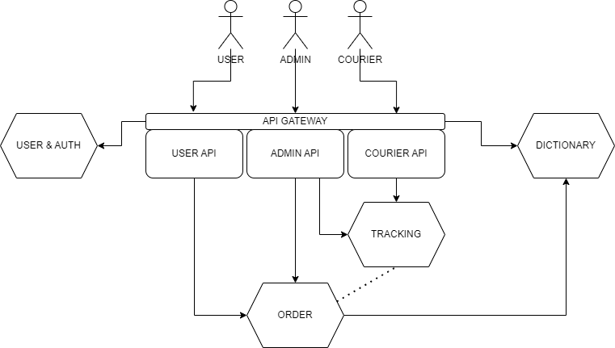

# Parcel Delivery app
___

This is micro CRM to create order for delivering a parcel
from point A to point B. The CRM based on microservices
architecture which adapted to clustering. Currently, this
system consists of below:
- API Gateway
- User account & Authorization service
- Order service
- Dictionary service
- Tracking service
- Shared contract

___

## Architecture

___

## Quick start

To run that microservices' system, need to build docker image from gradle modules
and run docker-compose file.  

*Steps to run:*
- open terminal in root folder
- run gradle task `./gradlew bootBuildImage`
- then after building check that kafka container is running
- and then run docker build `docker-compose up --build -d`

>If there is necessary to run one of the services:  
>run `./gradlew [service]:bootRun`  
> &emsp;&emsp; where [service] - name one of the developed services
---

### Prerequisites

- Java 17
- Docker

---

### Configuring

---

### Building

1. Building simple set of services:  
`./gradlew bootBuildImage`

---

### Deploying

1. Deploying Spring Boot images to Docker  
`docker-compose up --build -d`