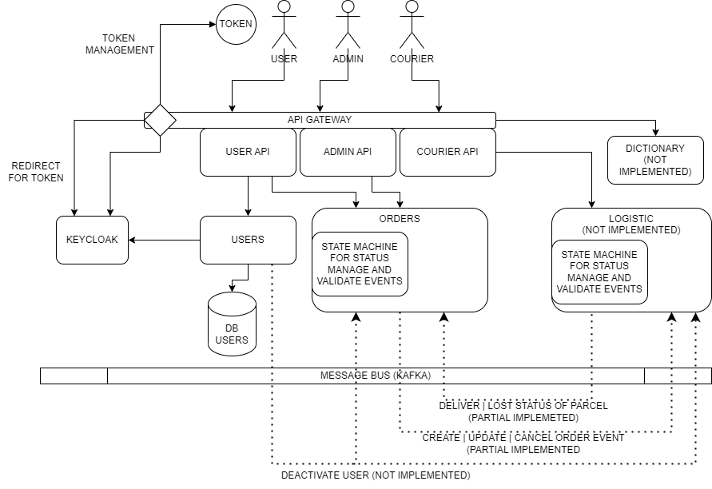

# Parcel Delivery app
___

This is micro CRM to create order for delivering a parcel
from point A to point B. The CRM based on microservices
architecture which adapted to clustering. Currently, this
system consists of below:
- API Gateway
- User account & Authorization service
- Order service
- Dictionary service
- Tracking service
- Shared contract

___

## Architecture

___

## Quick start

### Prerequisites

### Configuring

### Building

### Deploying